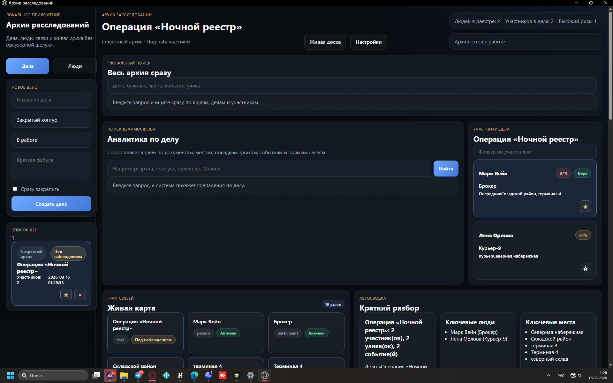

# Архив расследований

Локальное desktop-приложение для ведения дел, людей, связей, печатных досье и дополнительного эзотерического анализа.



## Возможности

- ведение дел и карточек людей
- привязка людей к делам с отдельным контекстом участника
- улики, события и связи внутри дела
- глобальный поиск по архиву
- живая карта связей
- автосводка по делу
- генерация PDF в формате досье и доски расследования
- матрица судьбы и чакроанализ по дате рождения
- интеграция с ИИ для сборки карточки и краткого досье

## Технологии

- `React + Vite + TypeScript` для интерфейса
- `FastAPI` для backend API
- `SQLite` для локальной базы данных
- `ReportLab` для генерации PDF
- `PyInstaller` для сборки desktop-версии в `.exe`

## Запуск в режиме разработки

```bash
npm install
python -m pip install -r requirements.txt
python -m backend.app
npm run dev
```

Фронтенд:
`http://127.0.0.1:1420`

Бэкенд:
`http://127.0.0.1:8000`

## Запуск как desktop-приложение

```bash
python desktop_app.py
```

## Сборка в EXE

```bash
build_exe.bat
```

или

```powershell
powershell -ExecutionPolicy Bypass -File .\compile_to_exe.ps1
```

Готовый файл появляется здесь:
`release/ArchiveInvestigations/ArchiveInvestigations.exe`

## Структура проекта

- `src/` — интерфейс приложения
- `backend/` — API, база данных, PDF, матрица, чакроанализ, ИИ
- `app_data/` — локальная база данных и рабочие данные
- `docs/` — изображения и материалы для репозитория
- `src-tauri/` — legacy-код старой Tauri-версии

## Примечания

- PDF сохраняются в `app_data/exports/`
- пользовательские изображения сохраняются в `app_data/uploads/`
- приложение рассчитано на локальную работу на Windows
